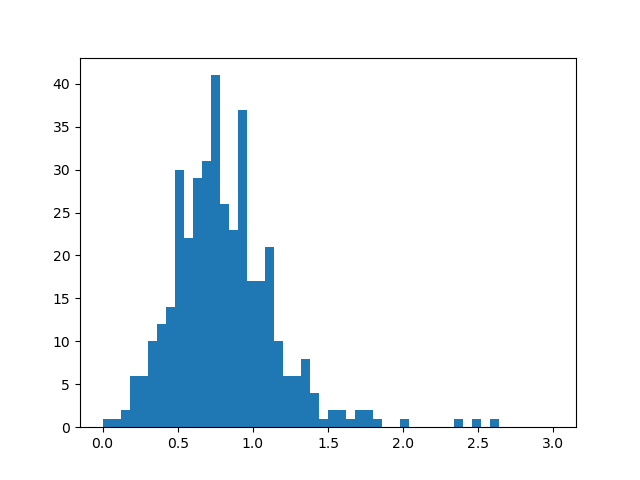

# Stock Analysis of Rapid Growth Stocks

### Introduction
I made a [Discord Bot (JemsRock Bot)](https://github.com/VolticFroogo/jemsrock-bot)
that tells you at the end of the day which stocks increased the most in value as a joke.

My friend noticed that the stocks that increased the most in value mostly decreased in value the within the next seven days (around 78% of them).

So we decided to analyse the data to see if we could **become rich really quickly** by shorting the stocks.

### So, do they decrease in value?
**Yes, they do.**

We plotted this at first, and after seven days the normal distribution was very clearly centred around 0.7 or so (meaning that the stocks decreased in value to 70% on average).

So, does this mean we can become rich? Just short the stocks and then buy them back after seven days?

### Stop Losses and stopping my dreams
Since we are shorting the stocks, we need to set a stop loss to prevent us from losing too much money if it went up in value.

We decided to set the stop loss at 2, meaning that if the stock increased in value by 100%, we would stop the trade and lose money.

So we took all stocks that went over the stop loss, set their value to 2, and then plotted the data again.

The mean average of the data was now around 0.9958, meaning we have no statistical advantage.

### Conclusion (the market is efficient, obviously)
Technical analysis is rarely effective, and this is no exception.

Was a fun lesson that the market is efficient though.